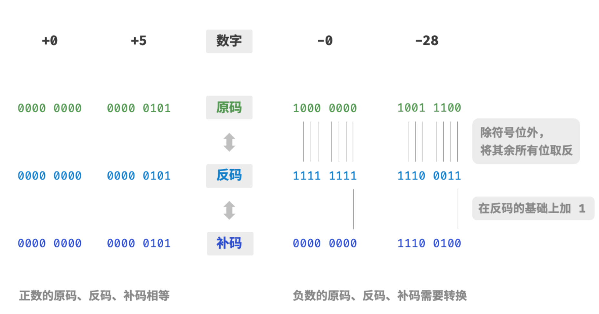
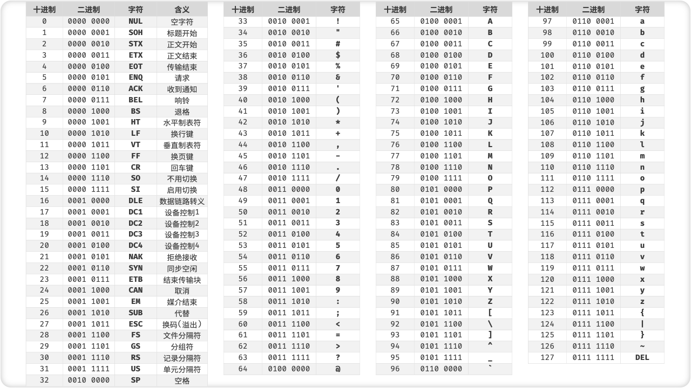

## 二进制

1. 位运算

    1. 与运算：&
    
        1. 用于清零
    
    2. 或运算：|
    
        1. 用于置 1
    
    3. 异或运算：^
    
        1. 用于取反
    
    4. 取反运算：~
    
        1. 用于取反
    
    5. 左移运算：<<
    
        1. 用于乘 2
    
    6. 右移运算：>>
    
        1. 用于除 2

2. 逻辑右移和算术右移

   逻辑右移：左边补 0

   算术右移：左边补符号位

思考：
    如何将一个数的第 n 位设置为 1？
    如何将十进制数转换为二进制文本？如 0x6F -> "01101111"

## 整数编码

首先需要指出，**数字是以“补码”的形式存储在计算机中的**。在分析这样做的原因之前，我们首先给出三者的定义。

- **原码**：我们将数字的二进制表示的最高位视为符号位，其中 $0$ 表示正数，$1$ 表示负数，其余位表示数字的值。
- **反码**：正数的反码与其原码相同，负数的反码是对其原码除符号位外的所有位取反。
- **补码**：正数的补码与其原码相同，负数的补码是在其反码的基础上加 $1$ 。

## 数据结构
下表列举了各种基本数据类型的占用空间、取值范围和默认值。

 表 <id> &nbsp; 基本数据类型的占用空间和取值范围 

| 类型   | 符号     | 占用空间         | 最小值                   | 最大值                  | 默认值         |
| ------ | -------- | ---------------- | ------------------------ | ----------------------- | -------------- |
| 整数   | `byte`   | 1 byte           | $-2^7$ ($-128$)          | $2^7 - 1$ ($127$)       | $0$            |
|        | `short`  | 2 bytes          | $-2^{15}$                | $2^{15} - 1$            | $0$            |
|        | `int`    | 4 bytes          | $-2^{31}$                | $2^{31} - 1$            | $0$            |
|        | `long`   | 8 bytes          | $-2^{63}$                | $2^{63} - 1$            | $0$            |
| 浮点数 | `float`  | 4 bytes          | $1.175 \times 10^{-38}$  | $3.403 \times 10^{38}$  | $0.0 f$        |
|        | `double` | 8 bytes          | $2.225 \times 10^{-308}$ | $1.798 \times 10^{308}$ | $0.0$          |
| 字符   | `char`   | 1/2/4 bytes      | $0$                      | $2^{16} - 1$            | $0$            |
| 布尔   | `bool`   | 1 byte           | $\text{false}$           | $\text{true}$           | $\text{false}$ |

## 大端与小端
"大端（Big Endian）"和"小端（Little Endian）"是计算机科学中用于描述字节顺序的术语。它们描述的是多字节数据类型（例如 32 位整数、64 位浮点数等）在内存中如何存储和表示的。

### 大端（Big Endian）

在大端字节顺序中，最高位字节（也称为“大端”字节）被存储在最低内存地址。

举个例子，假设我们有一个 16 位（2 字节）的整数 `0x1234`：

- 在大端模式中，它将被存储为：
  - （低）地址 `n`：0x12   （高位）
  - （高）地址 `n+1`：0x34 （低位）

### 小端（Little Endian）

在小端字节顺序中，最低位字节（也称为“小端”字节）被存储在最低内存地址。

还是用前面的 16 位整数 `0x1234`作为例子：

- 在小端模式中，它将被存储为：
  - （低）地址 `n`：0x34   （低位）
  - （高）地址 `n+1`：0x12 （高位）

### 重要性

理解大端和小端的重要性在于，不同的计算机体系架构可能采用不同的字节顺序。当在网络上传输数据或在不同架构的计算机之间交换数据时，字节顺序成为一个关键问题，因为接收方需要知道发送方使用的字节顺序来正确解释数据。这就是网络字节顺序（通常是大端）的来源。

在处理二进制数据时，例如在文件 I/O、网络通信以及跨平台开发中，理解和考虑到字节顺序是非常重要的，以确保数据能够在不同的系统和协议之间正确交换和使用。

## 字符编码

在计算机中，所有数据都是以二进制数的形式存储的，字符 `char` 也不例外。为了表示字符，我们需要建立一套“字符集”，规定每个字符和二进制数之间的一一对应关系。有了字符集之后，计算机就可以通过查表完成二进制数到字符的转换。

### ASCII 字符集

「ASCII 码」是最早出现的字符集，全称为“美国标准信息交换代码”。它使用 7 位二进制数（即一个字节的低 7 位）表示一个字符，最多能够表示 128 个不同的字符。如下图所示，ASCII 码包括英文字母的大小写、数字 0 ~ 9、一些标点符号，以及一些控制字符（如换行符和制表符）。

然而，**ASCII 码仅能够表示英文**。随着计算机的全球化，诞生了一种能够表示更多语言的字符集「EASCII」。它在 ASCII 的 7 位基础上扩展到 8 位，能够表示 256 个不同的字符。

在世界范围内，陆续出现了一批适用于不同地区的 EASCII 字符集。这些字符集的前 128 个字符统一为 ASCII 码，后 128 个字符定义不同，以适应不同语言的需求。

思考：
    将 0x12345678 转换为字符串"0x12345678"，要求不使用库函数。

### GBK 字符集

后来人们发现，**EASCII 码仍然无法满足许多语言的字符数量要求**。比如汉字大约有近十万个，光日常使用的就有几千个。中国国家标准总局于 1980 年发布了「GB2312」字符集，其收录了 6763 个汉字，基本满足了汉字的计算机处理需要。

然而，GB2312 无法处理部分的罕见字和繁体字。「GBK」字符集是在 GB2312 的基础上扩展得到的，它共收录了 21886 个汉字。在 GBK 的编码方案中，ASCII 字符使用一个字节表示，汉字使用两个字节表示。

## Unicode 字符集

随着计算机的蓬勃发展，字符集与编码标准百花齐放，而这带来了许多问题。一方面，这些字符集一般只定义了特定语言的字符，无法在多语言环境下正常工作。另一方面，同一种语言也存在多种字符集标准，如果两台电脑安装的是不同的编码标准，则在信息传递时就会出现乱码。

那个时代的研究人员就在想：**如果推出一个足够完整的字符集，将世界范围内的所有语言和符号都收录其中，不就可以解决跨语言环境和乱码问题了吗**？在这种想法的驱动下，一个大而全的字符集 Unicode 应运而生。

「Unicode」的全称为“统一字符编码”，理论上能容纳一百多万个字符。它致力于将全球范围内的字符纳入到统一的字符集之中，提供一种通用的字符集来处理和显示各种语言文字，减少因为编码标准不同而产生的乱码问题。

自 1991 年发布以来，Unicode 不断扩充新的语言与字符。截止 2022 年 9 月，Unicode 已经包含 149186 个字符，包括各种语言的字符、符号、甚至是表情符号等。在庞大的 Unicode 字符集中，常用的字符占用 2 字节，有些生僻的字符占 3 字节甚至 4 字节。

Unicode 是一种字符集标准，本质上是给每个字符分配一个编号（称为“码点”），**但它并没有规定在计算机中如何存储这些字符码点**。我们不禁会问：当多种长度的 Unicode 码点同时出现在同一个文本中时，系统如何解析字符？例如给定一个长度为 2 字节的编码，系统如何确认它是一个 2 字节的字符还是两个 1 字节的字符？

对于以上问题，**一种直接的解决方案是将所有字符存储为等长的编码**。如下图所示，“Hello”中的每个字符占用 1 字节，“算法”中的每个字符占用 2 字节。我们可以通过高位填 0 ，将“Hello 算法”中的所有字符都编码为 2 字节长度。这样系统就可以每隔 2 字节解析一个字符，恢复出这个短语的内容了。

然而 ASCII 码已经向我们证明，编码英文只需要 1 字节。若采用上述方案，英文文本占用空间的大小将会是 ASCII 编码下大小的两倍，非常浪费内存空间。因此，我们需要一种更加高效的 Unicode 编码方法。

### UTF-8 编码

目前，UTF-8 已成为国际上使用最广泛的 Unicode 编码方法。**它是一种可变长的编码**，使用 1 到 4 个字节来表示一个字符，根据字符的复杂性而变。ASCII 字符只需要 1 个字节，拉丁字母和希腊字母需要 2 个字节，常用的中文字符需要 3 个字节，其他的一些生僻字符需要 4 个字节。

UTF-8 的编码规则并不复杂，分为以下两种情况。

- 对于长度为 1 字节的字符，将最高位设置为 $0$、其余 7 位设置为 Unicode 码点。值得注意的是，ASCII 字符在 Unicode 字符集中占据了前 128 个码点。也就是说，**UTF-8 编码可以向下兼容 ASCII 码**。这意味着我们可以使用 UTF-8 来解析年代久远的 ASCII 码文本。
- 对于长度为 $n$ 字节的字符（其中 $n > 1$），将首个字节的高 $n$ 位都设置为 $1$、第 $n + 1$ 位设置为 $0$ ；从第二个字节开始，将每个字节的高 2 位都设置为 $10$ ；其余所有位用于填充字符的 Unicode 码点。

下图展示了“Hello 算法”对应的 UTF-8 编码。观察发现，由于最高 $n$ 位都被设置为 $1$ ，因此系统可以通过读取最高位 $1$ 的个数来解析出字符的长度为 $n$ 。

但为什么要将其余所有字节的高 2 位都设置为 $10$ 呢？实际上，这个 $10$ 能够起到校验符的作用。假设系统从一个错误的字节开始解析文本，字节头部的 $10$ 能够帮助系统快速的判断出异常。

之所以将 $10$ 当作校验符，是因为在 UTF-8 编码规则下，不可能有字符的最高两位是 $10$ 。这个结论可以用反证法来证明：假设一个字符的最高两位是 $10$ ，说明该字符的长度为 $1$ ，对应 ASCII 码。而 ASCII 码的最高位应该是 $0$ ，与假设矛盾。

除了 UTF-8 之外，常见的编码方式还包括以下两种。

- **UTF-16 编码**：使用 1 或 2 个 16 位的代码单元（code units）表示。因此，每个代码单元由 2 个字节（16 位）组成。
- **UTF-32 编码**：每个字符都使用 4 个字节。这意味着 UTF-32 会比 UTF-8 和 UTF-16 更占用空间，特别是对于 ASCII 字符占比较高的文本。

从存储空间的角度看，使用 UTF-8 表示英文字符非常高效，因为它仅需 1 个字节；使用 UTF-16 编码某些非英文字符（例如中文）会更加高效，因为它只需要 2 个字节，而 UTF-8 可能需要 3 个字节。

从兼容性的角度看，UTF-8 的通用性最佳，许多工具和库都优先支持 UTF-8 。

## 堆和栈
堆（Heap）和栈（Stack）是两种不同的内存分配区域，它们在计算机程序中用于不同的目的。理解它们的区别和用途对于理解计算机程序的工作方式、优化内存使用和防止相关的错误（例如内存泄漏或栈溢出）非常重要。

### 栈（Stack）

- **分配速度**：栈内存分配和回收速度非常快。
- **内存管理**：由操作系统自动管理。当函数调用结束后，其在栈上分配的内存会自动被回收。
- **生命周期**：栈上的数据通常具有已知的、固定的生命周期。它们在作用域结束时被销毁。
- **大小**：栈的大小通常受到严格的限制，它的空间通常相对较小。
- **用途**：局部变量、函数参数等通常存储在栈上。

### 堆（Heap）

- **分配速度**：与栈相比，堆的内存分配和回收速度较慢。
- **内存管理**：需要手动管理。你需要手动分配内存，并在完成使用后手动释放它。
- **生命周期**：堆上的数据的生命周期不确定，它们保持分配状态，直到显式释放为止。
- **大小**：通常堆的大小要比栈大得多。
- **用途**：动态内存分配，例如创建对象或动态数组时，通常使用堆内存。

### 区别与应用

- **栈**对于具有短暂生命周期的、大小已知的数据和不需要动态分配内存的情况是非常有效的。
- **堆**适用于你不知道在编译时需要多少内存的情况，或者你需要分配大块的内存。

理解这些概念可以帮助你编写更高效、更安全的代码，特别是在低级编程语言（如 C 或 C++）中，其中内存管理是手动进行的。在一些高级编程语言中，虽然提供了自动内存管理（比如通过垃圾收集），但理解堆和栈的工作方式仍然是优化性能和避免错误的关键。

